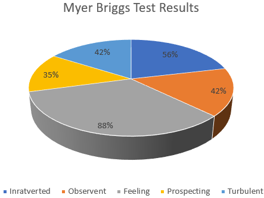
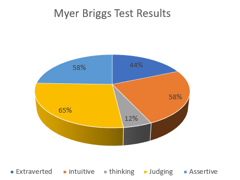

# ASSIGNMENT 1

<h1>Name: Kerri Schmidt</h1>
  <h2>Student Number: S3732454 </h2>
  <h2>Email Address: s3732454@student.rmit.edu.au </h2> 
  <h2>Nationality: I am Australian, Born in Warwick, QLD. </h2>
  

<h1>MY BACKGROUND:</h1>
<h2>Education:</h2> 

Certificate 2 in Security Operations 2005 and Certificate 3 in Security Operations in 2008. Completed Senior First Aid in October 2018.Completed Management Diploma through Evocca College in 2015. Completed Accounting Diploma through, Australian College of Commerce and Management in 2016. Started Bachelor of Business (Financial Planning) through OUA in 2018. 

  
<h2>Interesting fact about me:</h2>

I have had a story about me published in Take 5 Magazine in 2014, which is also published online for a health magazine in Dubai. 

  
<h2> Information Technology:</h2> 

I first became interested in IT when I was in year 10 at Balaklava High School in 1997. A fellow student and I were appointed as IT monitors for our newly built computer room. When the computer room was established, we both had to set all the computers up, install all running programmes ready for students to use. As monitors of the computer room we were monitoring internet usage of the students ensuring that they were not researching prohibited things. We were also appointed as troublshooters for any issues a student may have had with their computer. We would help solve any issues that arose with the computer. I lost interest in IT when I moved away from home to study year 12 at another school. My rebellion started and my interest withered with it. 

I am now interested in IT and what it can do for the Financial Services domain. The technological advances within the finance sector has changed the way we bank today. The introduction of apps on a smart phone for everything banking from Bpay for bills, to apple pay. Apple pay technology has allowed users to pay for goods or services at an EFTPOS machine with an application on their phone that stores their bank card, allowing shoppers to hold their phone near the EFTPOS machine to pay for goods. I am interested in safeguarding banking details to decline theft. WIFI technology on your phone is not totally failsafe, leaving loopholes for hackers to steal money from your bank account using WIFI. 
 

I chose to study with RMIT because I am a mum working full time as a Maritime Security Guard, I have been working in the security sector for 13 years, I have always had an interest in finance and have chosen to follow my dream. RMIT online allows me to study when I want, where I want. 
 

 By studying introduction to IT I expect to learn what technology advances have been made within the finance industry and how better we can be savvier to safeguarding personal information. I am particularly interested in cyber security as a whole and what we can do as individuals 
  
  
<h2>MY IDEAL JOB IS:</h2>

"

<a href="https://www.seek.com.au/job/39215928?searchrequesttoken=c1e371d2-5e0f-427a-8536-d9308afabcd4&type=standard/"> www.seek.com.au</a>

<h3> Financial Controller </h3>

 Position: A senior management role that oversees all functions of an organisations finance department. For any Finance controller position the applicant would need to possess high level analytic skills, exceptional management ability with at least 5 years’ experience in the position or a similar role. 

 This position highly appeals to me as I have a commitment to understand, care for and guide others to make financial decisions. I have a passion for helping others budget, prepare for retirement, manage share portfolios. I have been helping many family and friends with these decisions for many years and love every moment so have a passion to extend these skills professionally. Ever since my first job as pay master for a friend’s company where I handled tax invoices, payroll, superannuation, bank reconciliations etc at the age of 15, my addiction to money was ignited. 

<h3> Skills, qualifications and experience required </h3>

 Cash flow management, high level financial reporting, Reducing costs around the business and improving current efficiencies, managing stakeholders, Debt management, preparation of BAS and company statements, developing financial reviews and offering investment advice, payroll processing, working in collaboration with management teams to share financial report findings, mentoring and possess well developed leadership skills. 
<h3> Skills, qualifications and experience I currently have </h3>

 Cash flow management for small family business, basic level of financial reporting, improving current efficiencies and reducing business costs, debt management, basic preparation of company and BAS statements, payroll processing, bank reconciliations. 
<h3> How I will obtain the skills </h3>

TO obtain the skills of high-level financial reporting I will volunteer my time within a small non for-profit organisation just to get a better grasp on regular financial reporting. I will use this opportunity to offer basic financial advice and work in collaboration with management teams to share financial report findings. I feel that doing this for a smaller business at first will give me more confidence for a higher-level business. 
 
  
<h2> PERSONAL PROFILE </h2>

<h3>Online Learning Style. </h3>

 My results based on my online learning style is that I am an auditory learner. I have an immense ability to remember what I hear and say. I really enjoy a classroom environment where I can take part in small group discussions to reinforce my learning. I can remember instructions well and am able to perfect my understanding better when I carry out a given task. 

 I find it easier to understand things when I can study with a friend and discuss what I have learnt. When reading I tend to skip through the main content however, I take not of pictures, bullet points and chapter titles then read out loud what I think it is about. I regularly make flash cards for various materials I have learnt and read them out loud repeatedly. I prefer to discuss ideas I do not totally understand to deepen my understanding. I am very easily distracted from the task at hand and hate loud noises around me while trying to study. 

<h3> Myers Briggs Personality Test </h3>
  

 Based on the results of the Myers Briggs Personality test I am an Advocate. I have a sense of idealism and morality and can take concrete steps to realise my goals and make a positive and lasting impact. I love helping people, but I also thrive on making people realise that they don't need my help either. I teach them to be confident in their abilities and knowledge enough to not need me to help them at all. 

  

<h4> Strengths </h4>

 I have a vivid imagination and a very strong sense of compassion. I find it difficult to solve technical issues but love finding the perfect solution for my loved ones. I can see through dishonesty and ulterior motives because of this I prefer to get into an honest discussion quickly to get to the heart of something. 

 I am inspiring yet convincing. My writing style is fluid and inspirational, instantly appealing to the inner idealist. I find that when I am proud of what I am speaking or writing about I can get my point across easily with passion, however if my passion for the subject is decreased, I tend to lose interest quickly and become distracted. 

 I am very decisive, I follow through on my ideas with conviction, willpower and necessary planning to see things through to the end. Rather than seeing things as they I would like them to be, I act on them to make them a reality. 

 I am determined and passionate, when I see something as important, I pursue it with conviction that even surprises those around me. I will rock the boat if I must achieve what I want, much to the dislike of many, but my passion for my cause is not seen by everyone, even those close to me. 
 

<h4> Weaknesses</h4>

I am highly vulnerable to criticism, questioning my motives will get you on my bad side very quickly. 

 I am extremely private when it comes to my personal life, I do this to avoid truly opening up to someone. 
 

It takes me a while to trust new friends and even longer to gain back trust when it broken for any reason. 

 I am very perfectionistic, my pursuit for the ideal even in situations where it is not always possible such as business and romance. 

I too easily drop and ignore healthy relationships believing that I deserve more and that there are better ones down the road. 

 I will not settle for less than perfect and resent people that try to get in my way of achieving perfection in all that I do (particularly so at exam time eek??) 

 I always need to have a cause - I get so caught up in the passion of my pursuit that any other cumbersome maintenance work that comes in between that is seen as cumbersome. 

Even personal maintenance of myself such as family time or social time, I find that when I am away from a task that is not aimed at pursuing my dream I am not fully satisfied, I am always thinking that I need to get back to studying. As a chronic pain sufferer, it is this because that not only keeps me distracted from the pain but also keeps me going, feeling like I am achieving something. This even raised by my pain psychologist asking if I need to always achieve something to feel worthy - my response was "yes" 
 

 I burn out very easily - My passion and poor patience for routine maintenance, and tendency to prove myself as ideal tend to leave me with minimal options to let off steam. Finding me likely to exhaust myself in short order if I don't find a way to balance my ideals with day to day living. 

  
  
<h3> Big Five Personality Test </h3>

<h4> Openness - 62.5% </h4>

 According to the Big Five Personality test; People who get high scores for openness are typically adventurous, creative and intellectual. Whilst low scorers tend to be practical, conventional and focused. Depending on the parameter of interest for this test it’s hard to know where I sit on this scale. 

<h4> Conscientiousness - 85% </h4>

 This is a person ability to exercise self-discipline. As a security officer this result does not surprise me. High scorers are organised and determined, with the ability to forego short term gratification for the sake of long-term achievement. 

<h4> Extraversion - 73% </h4>

 I find myself as someone that is very outgoing and confident, which could explain a high score in this area. As a socialite I am very confident and seek approval from all around me. However, on the same token their approval is not important to me, I am a person that thinks if someone does not like me or approve of me or what I’m doing it is their problem not mine. 

<h4> Agreeableness - 81% </h4>

I am often a person to put others needs before my own, my compassion for others is quite high due to lifetime stresses I have endured. I love to take care of others I feel like it gives me a sense of belonging, pride and comfort. 

<h4> Neuroticism - 40% </h4>

I have scored low in this area, I used to be a person to let other emotions bring me down or ignite fear or sadness. Now I am a person that does not let things bother me as much, any misfortune I come up against now I am able to brush off and move on. 

<h3> What do these results mean to me? </h3> 

They have given me a sense of completeness knowing that I am on the right track to success. I am on my ideal path in life now and these results have just confirmed that. Finding out my online learning style test has given me ways on which I could make my study experience a successful one, the results confirmed what I knew already but knowing how I can improve my learning experience is something I did not know. 

<h3> How do you think these results would influence your behaviour in a team? </h3>

The knowledge of these results will influence me in a positive way for a team exercise. Rather than finding the need to do more I will rely more on my team to produce a joint effort. I endeavour to learn more trust in my teammates with knowledge that they are driving for the same level of perfection with the drive to achieve high distinctions, like myself. I am typically a person that likes to take charge when I am confident in my knowledge and abilities. IT is a weak area for me so I will take more direction from other team members and ask more questions to further cement my understanding. With techniques on how to improve my learning style I will do more activities that suit my learning style, such as group discussions. 
 

<h3> How should you take this into account when forming a team? </h3>

I will look to engage with other students that share a drive for perfection and high scores. With feeling like a student with limited IT exposure and experience I will be looking for others that have vast knowledge so that I can learn from them to improve my confidence. I will search for people that are not scared to take a leadership role and will use my conscientiousness to find others who are also seeking long-term achievement and drive. 

  
<h2> PROJECT IDEA </h2>
<h3> Overview </h3>

I propose to develop a finance application that scans tax receipts and add them to necessary business statements instantly. This requires the user to choose which statement the data needs to be added to i.e. GST, BAS statements, Profit and Loss Statements, Stock inventory, purchases, sales etc. I aim for this to be all electronic so when the time comes to submit details to ATO that no further time will need to be allocated as receipts are added to each statement instantaneously. 

<h3> Motivation <h3>

According to Australian Bureau of Statistics at the end of 2017-2018 there were 2,313,291 actively trading businesses in Australia. Many hours can go into preparing just a BAS statement alone, that’s without all other business financial reports. Businesses spend thousands of dollars paying an accountant to prepare their financial reports, or spend many hours or days preparing them. With various statements being needed by the ATO on a regular basis businesses hire, accountants, finance controllers to monitor and maintain necessary reports. Application enhancements can streamline this process saving business time and money, allowing them to aim their efforts towards other business endeavours. 

  <h3> Description </h3>

A finance application that scans and stores your receipts also forwarding them to the necessary financial reports calculating instantly. Receipts for purchases will be forwarded to a balance sheet, income statement, statement of cash flows and BAS Statement template. A receipt for a business car will be forwarded to a car account that lists all costs including registration, maintenance, depreciation. This application will enter new scanned receipts but will also have the option to add bank account debits and credits to necessary financial reports based on key words within the payment description. 

 Templates of all business financial reports would need to be created so that information can be digitally uploaded. Folders that would store the scanned receipts would need to be created for general storage of data so that more than one copy is retained. 

 Inventory purchases will be recorded as a debit to bank account ledgers and a credit to inventory ledger. This purchase will also show in a BAS statement template, a cash flow statement, GST ledgers and balance sheet. A sale of goods or services will be added to income statement, GST received, Statement of Changes in Equity and Balance sheet. A sale transaction will show on income statement, changes in equity, balance sheet. A cost relating to a business car will be forwarded to GST payable/ receivable, income statement, cash flow statement balance sheet. Each transaction will be calculated instantly keeping track of all expenses without the need to balance necessary accounts. 

 A payment relating to GST will be forwarded to GST receivable or payable and BAS statement. Lodging of BAS statements will be electronically submitted when all required fields are complete. This function will save time and money on preparation of BAS statements. The user will have the option to enter the GST component of the invoice to related templates 

 A debit from a bank account for wages will be forwarded to BAS statement, financial statement, profit and loss statements and income statement. In addition, would also need to be recorded in GST payable as portion of income tax. Another portion of 9.5% will be forwarded to an account that the business would pay superannuation from. A credit to a bank account for wages from providing a service will be forwarded to invoicing, financial statement, Balance Sheet and income statement. 

 Payment to suppliers for goods i.e. uniforms will be forwarded to Tax deductions, BAS Statements and GST ledgers. Payment for services such as accountant would be forwarded to Financial Statements, Cash flow statement, GST ledgers and BAS statement. All financial report templates will be stored and updated instantaneously. 

<h3> Tools and Technologies </h3>

 As outlined on https://www.datamation.com/open-source/101-open-source-tools-for-developers-1.html an API will help the developer by listing communication protocols and building blocks for the developer to put together to build their software. An API will simplify programming by only exposing actions that the developer requires. By using an API for file input the developer may be able to copy from one location to another without the need for the developer to understand operations that will take place behind the scenes. I would ideally use Apigility as it claims, " to be the world's easiest way to create high-quality API's" Enabling users to create their first within seconds. Due to my limited experience and knowledge of the IT world this would be a preference to enhance my project as my PC runs Windows10 as a suggested operating system for Apigility. I would use Appcelerator Titanium for mobile development part of my project. Appcelerator is a cross-platform IDE compatible with thousands of devices and Operating system API's. 
 

<h3> Skills Required </h3>

 As outlined on www.urbanpro.com, software Developers need to have knowledge of programming languages, life cycle of software development, operating systems, hardware and technical skills and other computer related terminologies. There are companies that use different programming languages for developing software so possessing knowledge of this is an advantage. Any software developer would need know the latest trends and possess the skills to keep them competitive in the IT market. 

 Every developer must have exceptional problem-solving skills as this is their primary duty. The coding that is done in software development provides the solution to any problem. The best way to learn is under the direction of experienced developers either face to face or via online forums. 

 Business skills are almost mandatory; many skilled developers can develop a software application but lack the insight behind its significance. Any manufactured product always has the needs of the client and the business at the crust of their project, so understanding them is an excellent advantage for them and any prospective employer. 

<h3> Outcome </h3>

